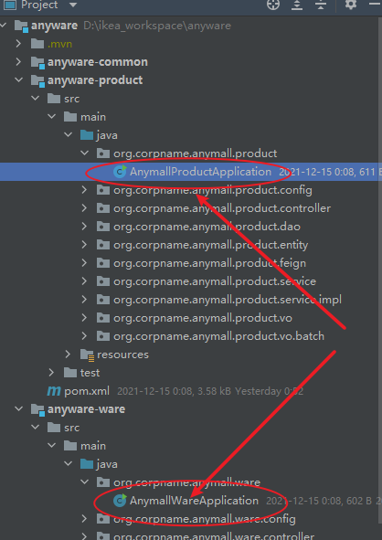
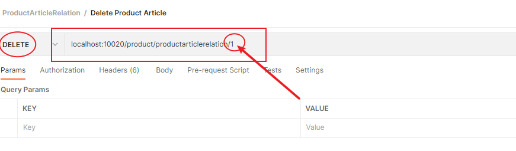

# Introduction 

*NOTE: You can refer to the pdf version for the attached photos.*

## Data Model Explained


## Naming Convention - API


### */<module_name>/<model-name>/*

- E.g., /product/product/: 
- 1st product is the module’s name, 
- 2nd is the model’s name. a module could have many model.
- The operation could be on the set of Products, including create or list.


### */<module_name>/<model_name>/{id}*

- E.g., /product/product/1: 
- The product id is 1
- The operation could be GET, DELETE, PUT on the product by given id


### */<module_name>/<model_name>/{id}/<options>*

- E.g., /product/product/1/withart: 
- Inspect the information for Product which product_id is 1, including the composed of Articles.


## Project Structure Explained

Coming soon (Not Started)

# **Quick Start**


## Install Nacos

It's very simple, see here: https://nacos.io/en-us/docs/quick-start.html

Please run it in standalone mode for non-cluster setup.

Default username and password are "nacos".

Default port is 8848


## Install MySQL (version > 5.6)

run the sql script below:

```
cd ${anyware_home}/sql
mysql -uroot -p < anyware_product.sql
mysql -uroot -p < anyware_ware.sql
mysql -uroot -p < anyware_order.sql

```


## Install the warehouse application

### Clone the repo

```
git clone https://github.com/beiji-ma/anyware.git
```

Update the IP address in each application.yml/application-dev.yml if you deploy the Nacos and the app on the different host server.


You need update the pom.xml to remove the setup related with nexus:


### Startup 2 modules below:




***Congratulations*** if you could see the 2 service below from the console of Nacos:


# Import the sample data:


## Inventory.json


## Product.json


Test:


Case 1.1: list all Inventory information


Case 1.2: Update stock


Case 1.3: Add Article(Inventory Item)


Case 1.4: Delete Article (Inventory Item)


Case 2.1: Query Order


Case 2.2: Create Order


Case 2.3: Ware Order Task


Case 3.1: Available stock for each product


Case 4.1: Lock Stock for Order (Incompleted)


Case 5.1: Query Product Article Relation


5.2: Create Product Article Relation


5.3: Update Product Article Relation


5.4: Delete Product Article


